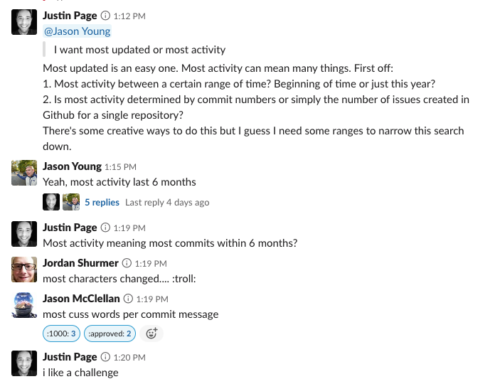

### Github most activity in six months

> The most activity by commits, in an organization, over a period of six months



### Before

You will need a personal access token in order to run this script:

https://developer.github.com/v3/auth/#via-oauth-and-personal-access-tokens

This means creating a personal access token for the command line.

### Compile 

You will need the latest stable version of go installed on your machine:

https://golang.org/dl/

Next, run the following command to grab any external dependencies:

`go get`

Finally, run the following command to build the binary for execution:

`go build report.go`

### Execute 

Export the following environment variables:

```
export GITHUB_USERNAME=<github-username>
export GITHUB_TOKEN=<github-personal-access-token>
```

Run report against an organization:

`./report <org-name>`

Report will provide a summary of repos ordered by commit number:

```
Grabbing list of all repos for git
Filtering list within six months of commit activity
Getting statistics for each repo from list
(http 202); retrying request...
(http 202); retrying request...

Summary
-------
git: 1073
git.github.io: 127
git-scm.com: 42
htmldocs: 32
```

### About 

The following script takes advantage of the following APIs:

- https://developer.github.com/v3/repos/#list-organization-repositories
- https://developer.github.com/v3/repos/statistics/

By using worker pools, we are able to get a list of repos concurrently. And by
using exponential back-off, we are able to obtain statistics about a repo within
two minutes --accounting for background jobs firing when compiling results.

Some future improvements include the following:
- Flags and arguments to adjust threshold and time range
- Implement testing package: https://golang.org/pkg/testing/
- Refactor exponential back-off to work smarter and not longer

### Note
Depending on Github's server performance, you might have to run this report
twice against the same organzation to verify the results are consistent. The
reason behind this is due to how our exponential back-off works. That is, it
only retries the request for up to two minutes --else it moves on. You might get
more results from a second run.
